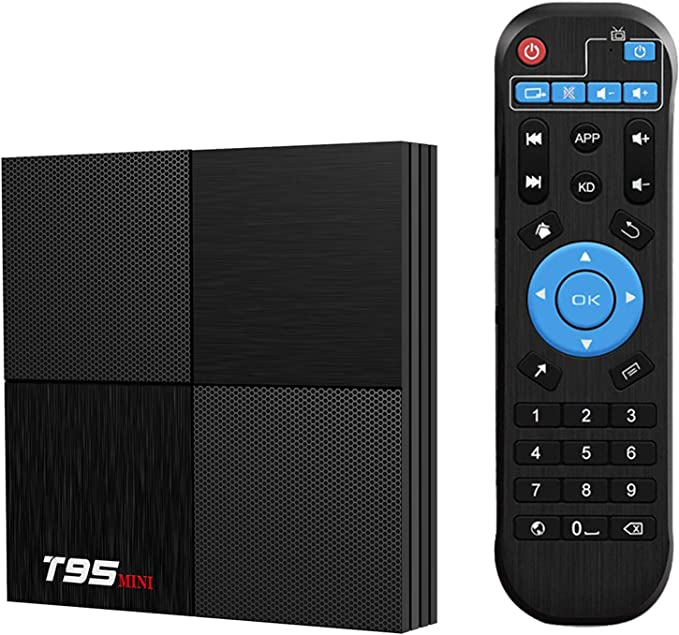

# Configuring an Android TV box (T95 Mini) with Armbian
This repo contains instructions for running Armbian on a cheap, Android TV box for tasks like Octoprint, Klipper, and more...

# Purchase a T95 Mini
The T95 Mini could be found for ~$33 on [Amazon](https://www.amazon.com/dp/B07SM8WTBT?psc=1&ref=ppx_yo2ov_dt_b_product_details) which includes a power cable (as of 5/1/2023).

# T95 Mini Specifications
- CPU: H6 Quadcore cortex-A53 frequency
- 2G GPU: Mali-T720MP2
- FLASH: 16GB
- SDRAM: 2GB
- Power Supply: DC 5V/2A
- WIFI: 2.4 Ghz
- Ethernet: RJ45 10/100M
- USB host: 1 High speed USB 3.0 and 1 High speed USB 2.0
- Card reader: SD/SDHC/MMC cards
- Video output: HDMI (SD/HD max)

# Download (or build) Inovato firmware & flash onto SD card
Firmware direct download: https://www.inovato.net/Armbian/Armbian_23.05.0-trunk_Inovato-quadra_bullseye_legacy_5.15.105.img.gz
Instructions for building firmware: https://forum.inovato.com/post/building-armbian-from-source-12449428?pid=1333459893
